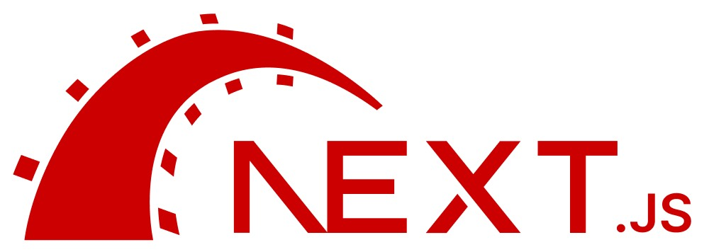

# Next Rails CLI

<a href="https://www.npmjs.com/package/next-rails" target="\_parent">
  
</a>



A CLI for generating a Next.js app with Rails CLI-like features. 

- Next.js 13.14.4 ✅
- TypeScript ✅
- ESLint ✅
- Tailwind CSS ✅
- [Shadcn UI compatible out of the box](https://ui.shadcn.com/docs/components) ✅
- Knex ✅
- PostgreSQL w/ PgVector ✅
- Prettier ✅
- Dockerfile for Development ✅
- Husky ❌
- Lint Staged ❌

✅ = Implemented
❌ = Not Implemented (Yet)

The lofty goal of this would be to generate scaffold for Next.js pages & api routes, models (typescript interfaces), migrations, seeds, and tests.

There are some ESLint & Prettier configurations built in that are opinionated. These may be configurable in the future.

## Installation

```bash
npm install -g next-rails
```

or use `npx` to run the CLI without installing it globally, which also ensures the latest version is used:

```bash
npx next-rails
```

## Usage

```bash
next-rails [command] [options]
```

## Commands

### `new` ✅

```bash
next-rails new [options] <app-name>
```

---

Important note: by default next-rails new will use PostgreSQL (currently the only supported DB) and the Primary Key Type will default to Auto-Incrementing Integer (`--primary-key-type integer`). If you want to use UUIDs as your primary key, you can pass the `--primary-key-type uuid` flag to the new command:
  
```bash
next-rails new my-app --primary-key-type uuid
```

Whatever value you use will be added to a `next-rails.config.json` at the root of your new application folder. You can change this value at any time and it will be used for all future migrations and models, though I don't recommend switching after creating a project.

---

Creates a new Next.js app using the [create-next-app](https://www.npmjs.com/package/create-next-app) package with some default options. 

Currently the following options are set for create-next-app:

```bash
create-next-app --ts --eslint --no-app --use-npm --src-dir --import-alias "@/*" --tailwind
```

### `generate` ✅

#### `next-rails generate model <model-name> [options]` ✅

```bash
next-rails generate model <model-name> [options]
```

Generates a new TypeScript interface representing a model with the given name and options. Note that for the model name, the singular form should be provided (ex: "Post" or "Todo"). This model interface will be created in the src/db/models directory. Each option should be a string in the format 'name:type'. The following types are currently supported:

- string
- text
- integer
- float
- decimal
- datetime (some known issues with editing the form item)
- timestamp (some known issues with editing the form item)
- time (some known issues with editing the form item)
- date (some known issues with editing the form item)
- binary (untested)
- boolean (some known issues with editing the form item)
- vector (pgvector only)
- references
- belongs_to

NOTE: Some of these may not have been fully vetted yet. Please open an issue if you find any bugs. If anything, it'll probably be the knex migration that needs to be mapped or the input html type.

The model interface will be created with the following default fields in addition to the fields specified by the options:

- id - integer OR string - Represents an integer OR uuid. (See the note above about the primary key type.)
- createdAt - Date - Represents the timestamp when the record was created.
- updatedAt - Date - Represents the timestamp when the record was last updated.

#### `next-rails generate scaffold <model-name> [options]` ✅

```bash
next-rails generate scaffold <controller-name> [options]
```

Executes the same operations as the model command described above, and additionally generates the following:

1) An API controller for the model in the pages/api directory. This controller handles CRUD operations (Create, Read, Update, Delete) for the model. The routes are as follows: 
* GET /api/plural-model-name/index - Returns all records.
* GET /api/plural-model-name/show/:id - Returns a single record.
* POST /api/plural-model-name/create - Creates a new record.
* PUT /api/plural-model-name/update/:id - Updates a record.
* DELETE /api/plural-model-name/destroy/:id - Deletes a record.

2) A Knex.js migration script in the src/db/migrations directory. This script includes functions to create and drop a database table representing the model. The table will include columns for each field in the model interface, as well as columns for createdAt and updatedAt.
Note that for the model name, the singular form should be provided (ex: "Post" or "Todo"), and the scaffold generator will use a plural form where appropriate. For example, if you generate a scaffold for 'post', the model will be named 'Post', the API controller will be at pages/api/posts.ts, and the migration script will create a table named 'posts'. 

3) Pages for the model in the pages directory. The following pages will be created: 
* /plural-model-name/index.tsx - A page that lists all records. (Index) ✅
* /plural-model-name/:id/index.tsx - A page that displays a single record. (Show) (Delete) ✅
* /plural-model-name/new.tsx - A page that allows you to create a new record. (Create) ✅
* /plural-model-name/:id/edit - A page that allows you to edit a record. (Update) ✅

### `migration:generate` ✅

#### `next-rails migration generate --name <migration-name>`

```bash
next-rails migration:generate --name <migration-name>
```

Generates a new migration with the given name. The migration will be created in the `src/db/migrations` folder.

### `db:migrate` ✅

```bash
next-rails db:migrate
```

Runs all pending migrations.

### `db:migrate:up` ✅

```bash
next-rails db:migrate:up
```

Runs the next pending migration.

### `db:migrate:down` ✅

```bash
next-rails db:migrate:down
```

Rolls back the last migration.

### `seed:generate` ✅

#### `next-rails seed:generate --name <seed-name>`

```bash
next-rails seed:generate --name <seed-name>
```

Generates a new seed with the given name. The seed will be created in the `src/db/seeds` folder.

### `db:seed` ✅

```bash
next-rails db:seed
```

Runs all seeds.

### `db:reset` ✅

```bash
next-rails db:reset
```

Drops all tables from the database. Then runs all migrations and seeds.

### `db:schema_dump` ✅

```bash
next-rails db:schema_dump
```

Dumps the schema of the database to a file `/src/db/schema.json`. This is automatically done after each migration, but this command manually triggers it.

## Deploying to Vercel
Make sure to add your cloud-based PostgreSQL connection string to the Environment Variables in your Vercel project settings. The connection string should be named `DATABASE_URL`. If you're using Neon, you need to add `?sslmode=require` onto the end of your connection string.

Then in your Build & Development settings, add the following to your Build Command as an Override:
```bash
next build && npx next-rails db:migrate
```

This will make sure whenever you make a new push to `main` or `master`, your migrations will be run automatically when Vercel builds your app.

## Adding shadcn components
If you want to add shadcn components to your project, you can do so by running the following command:
```bash
npx shadcdn-ui add component-name
```

You'll see a prompt asking where you would like to install your components and if you follow our recommend path with `next-rails` it would be `src/components` like so:
```bash
$ npx shadcn-ui add navigation-menu
Running the following command will overwrite existing files.
Make sure you have committed your changes before proceeding.

✔ Where would you like to install the component(s)? … src/components
✔ Creating src/components...
Installing 1 component(s) and dependencies...
✔ Navigation Menu
```

You can find a [list of all of the shadcn components here](https://ui.shadcn.com/docs/components). Our project is not endorsed by or related to shadcn, we just like their components and follow their convention to remain shadcn CLI compatible.